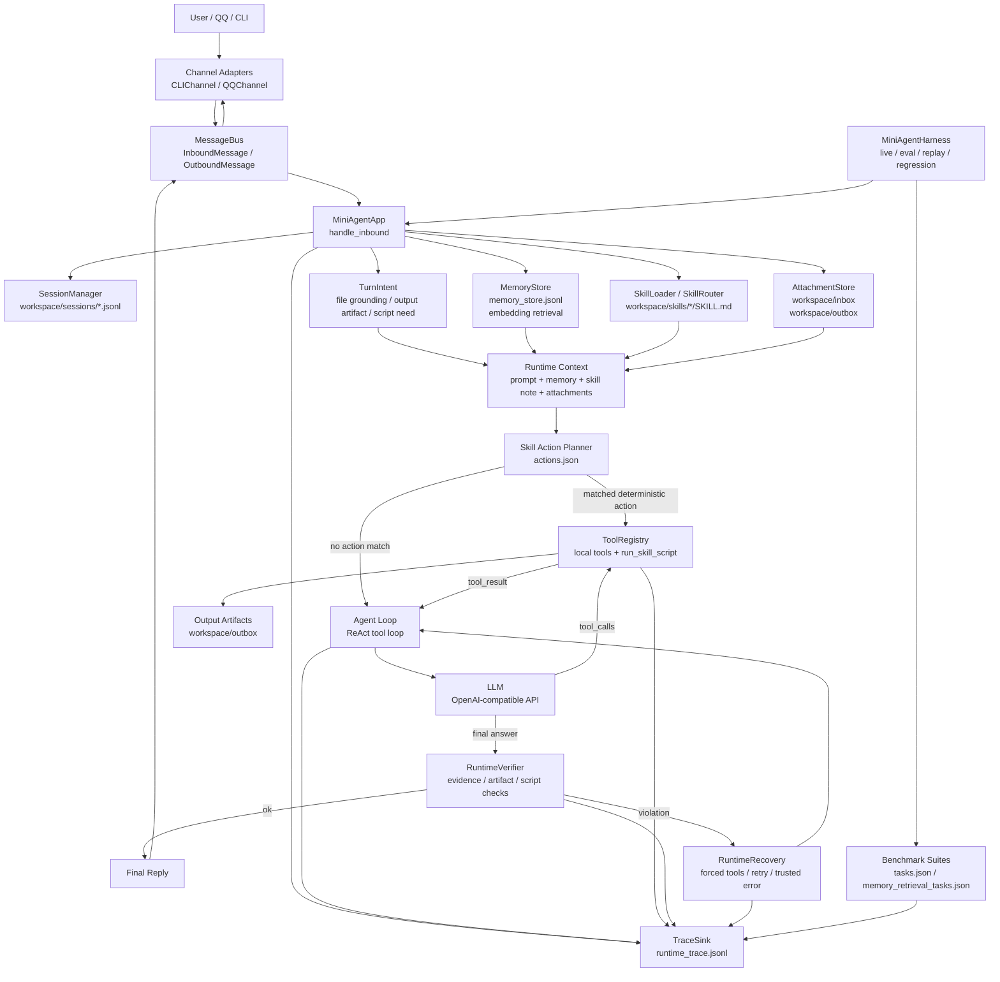
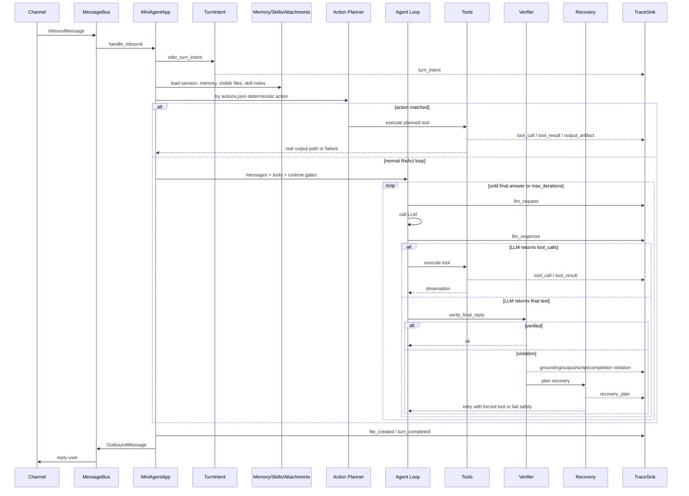
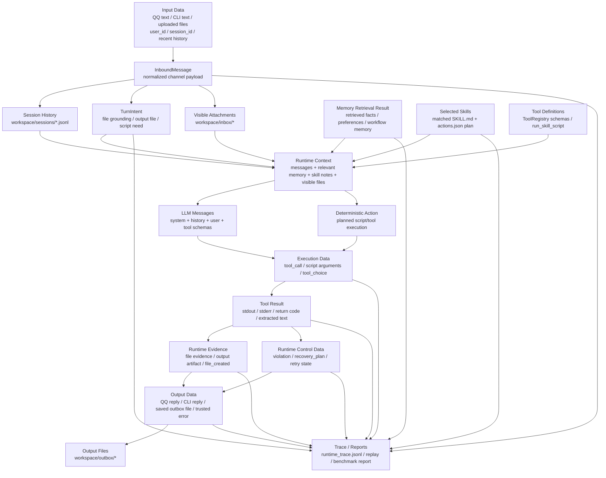

# MiniAgent Architecture

MiniAgent 是一个本地任务型 Agent Runtime。它的核心不是单次聊天，而是把多渠道消息、文件上下文、长期记忆、Skill、工具调用、运行校验、trace 和评测统一到一条可观察的执行链路里。

## System Overview

## Runtime Turn Flow

## Data Flow

## Key Design Points

- **Channel 解耦**：CLI 和 QQBot 都转换成统一消息对象，核心 runtime 不绑定具体渠道。
- **工具协议层**：Agent loop 只依赖 `ToolRegistry.get_definitions()` 和 `ToolRegistry.execute()`，后续可以接 MCP-compatible adapter。
- **Skill 不等于执行**：`skill_activation` 只表示选中了 skill，真正执行必须看 `run_skill_script` 的 `tool_result`。
- **Verifier/Recovery 是控制面**：文件证据、输出产物、脚本执行和中间态回复都由 runtime 校验，不只靠模型自觉。
- **Harness 是工程入口**：live、eval、isolated workspace、replay、regression 复用同一套 assembly。
- **Trace 是事实来源**：调试时优先看 `turn_intent -> llm_request -> llm_response -> tool_call/tool_result -> violation/recovery_plan -> turn_completed`。
