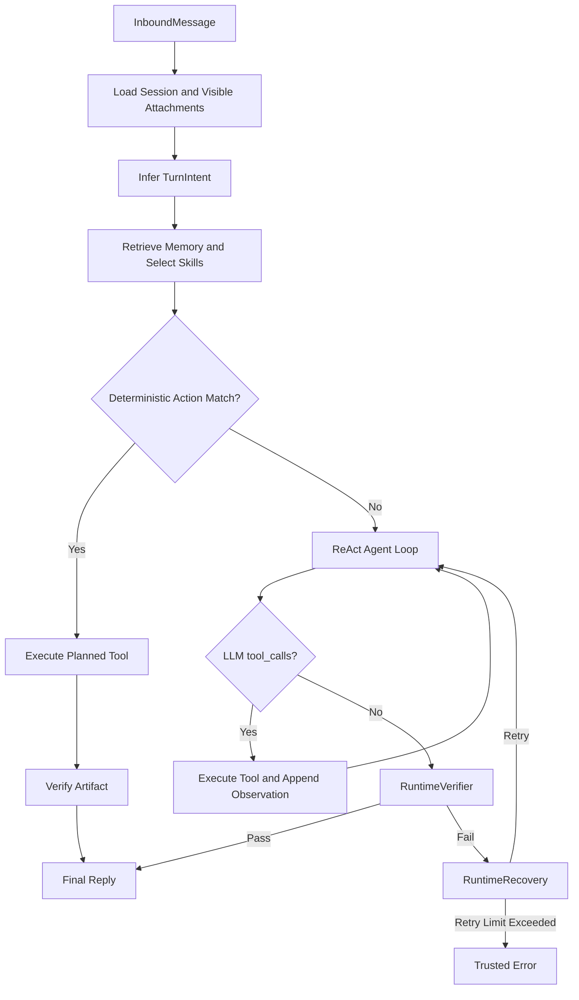

# Architecture Spec: MiniAgent

## 1. 架构目标

MiniAgent 将 Agent 的推理能力与工程控制面分离：

- 模型负责理解请求、选择工具和组织回复。
- Runtime 负责状态、证据、产物、脚本执行、校验与恢复。
- Harness 负责统一装配、隔离评测、trace、replay 和 regression。

完整架构图见 [../../ARCHITECTURE.md](../../ARCHITECTURE.md)。

## 2. 分层架构

```text
Channel Layer
  CLIChannel / QQChannel
        |
Message Layer
  InboundMessage / OutboundMessage / MessageBus
        |
Application Runtime
  MiniAgentApp / TurnIntent / Agent Loop
        |
Execution Layer
  ToolRegistry / SkillLoader / SkillRuntime / Action Planner
        |
Control Layer
  RuntimeVerifier / RuntimeRecovery / TraceSink
        |
State Layer
  Sessions / Memory / Inbox / Outbox / Traces
        |
Harness Layer
  Live / Eval / Isolated Workspace / Replay / Regression
```

## 3. 核心模块职责

| 模块 | 职责 | 不负责 |
| --- | --- | --- |
| `channels.py` | 适配 CLI、QQBot，转换标准消息 | Agent 推理与文件处理 |
| `message.py` | 定义消息对象与异步消息总线 | 持久化会话 |
| `app.py` | 编排一次运行、执行 ReAct 工具循环 | 长期保存 Skill 逻辑 |
| `intent.py` | 输出结构化 `TurnIntent` | 代替模型完成任务 |
| `tools/` | 提供统一工具协议与执行入口 | 判断最终回复是否可信 |
| `skills/` | Skill 路由、Action、受控脚本执行 | Channel 接入 |
| `memory.py` | Session、consolidation、长期检索 | 文件附件索引 |
| `runtime_verifier.py` | 校验最终回复是否满足真实证据 | 执行恢复 |
| `runtime_recovery.py` | 根据错误类型生成恢复计划 | 判断回复是否正确 |
| `harness/` | 统一装配、eval、trace、replay、compare | 替代真实 Agent Runtime |

## 4. Agent 交互流程



## 5. ReAct 与 Runtime Gate

标准 ReAct 循环是：

```text
LLM Reasoning -> Tool Call -> Tool Result -> LLM Reasoning -> Final Answer
```

MiniAgent 在此基础上增加：

```text
TurnIntent -> ReAct -> RuntimeVerifier -> RuntimeRecovery -> Final Answer
```

Runtime gate：

| Gate | 触发条件 | 成功证据 | 失败恢复 |
| --- | --- | --- | --- |
| File Grounding | 请求涉及可见附件内容 | 成功读取/提取或 runtime preload | 强制读取工具 |
| Output Artifact | 请求要求保存、导出、修改文件 | `output_artifact` / `file_created` | 强制输出工具 |
| Script Execution | 本轮需要脚本型 Skill | `run_skill_script` 且 Return code 0 | 强制脚本工具 |
| Claim Verification | 回复声称已完成操作 | 对应工具与产物证据 | 修正声明或真实执行 |
| Completion | 工具后只回复处理中 | 完整结果或可信失败 | 继续执行 |

## 6. 数据与状态设计

| 数据 | 位置 | 生命周期 |
| --- | --- | --- |
| 用户上传文件 | `workspace/inbox/` | 按会话保留 |
| Agent 输出产物 | `workspace/outbox/` | 按会话保留 |
| 短期会话 | `workspace/sessions/*.jsonl` | 可 consolidation |
| 长期记忆 | `workspace/memory/memory_store.jsonl` | 持久化 |
| Runtime trace | `workspace/traces/runtime_trace.jsonl` | 可 replay |
| Skill trace | `workspace/skills/skill_trace.jsonl` | 脚本审计 |
| Eval 临时状态 | `workspace/benchmarks/tmp/<run>/<task>/` | 可删除 |
| Eval 报告 | `workspace/benchmarks/results/` | 回归分析 |

## 7. Harness 隔离模型

Live：

```text
project_workspace = workspace
state_workspace   = workspace
```

Isolated Eval：

```text
project_workspace = workspace
state_workspace   = workspace/benchmarks/tmp/<run_id>/<task_id>
```

这样评测复用真实 Skill 和配置说明，但不污染 live 状态。该隔离是 workspace 状态隔离，不是操作系统级沙箱。

## 8. 安全设计

- API Key 和 Channel Secret 使用环境变量。
- SkillRuntime 只执行 Skill 目录下的相对 `.py` 路径。
- inbox 原文件只读，修改结果写入 outbox。
- RuntimeVerifier 阻止缺少证据的成功声明。
- Trace 提供执行审计，但避免将密钥写入 trace。

## 9. 扩展设计

- 使用 MCP-compatible adapter 接入外部工具，同时保留 Verifier、Recovery 和 Trace 控制面。
- 增加 attachment index，稳定恢复历史附件可见性。
- 增加 user-scoped memory，实现多用户长期记忆隔离。
- 引入结构化 workflow planner，支持多 Skill 多步骤任务。
- 增加 Docker 沙箱和云端部署。

